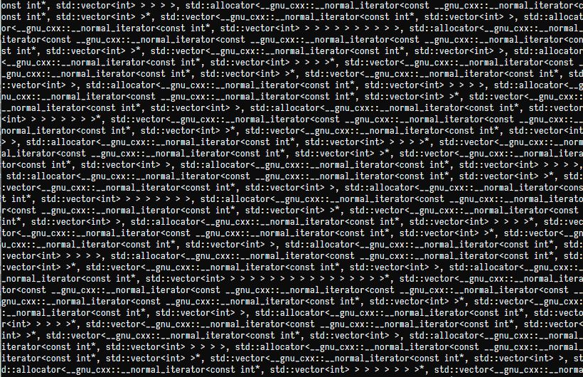

今天看知乎发现一个有趣的C++的错误，文章源自：https://zhuanlan.zhihu.com/p/63643875 及其下的讨论区

首先参考代码如下：

```cpp
//-std = c++17
#include <stdio.h>
#include <vector>

template <typename T>
void printV(const std::vector<T>& v) {
  if (v.size() == 1) {
    printf("%d ", v[0]);
    return;
  } else if (v.empty()) {
    return;
  }
  size_t middle = v.size() / 2;
  printV(std::vector{v.begin(), v.begin() + middle});
  printV(std::vector{v.begin() + middle, v.end()});
}

int main() {
  std::vector<int> v = {1, 2, 3};
  printV(v);
  return 0;
}
```

先提醒：不要直接复制这段代码进IDE，我在Mac下复制了这段代码，CLion在静态分析时候就直接卡死了...编译这段代码，编译器会在模板参数推理的过程中无限循环

`std::vector{...}`这个C++17的新特性[模板参数推理](https://en.cppreference.com/w/cpp/language/class_template_argument_deduction)推导出`std::vector<T>`中的模板参数`T`，而发生这个问题的核心是：**因为现代的C++编译器会把列表初始化的`{}`中的内容强烈地先当做初始化列表倾向**

`std::vector{v.begin(), v.begin()+ middle}`这句代码，编译器会构造一个含有`std::vector<int>::iterator`的向量，即：`std::vector<std::vector<int>::iterator>`。这样下来，递归调用`printV`时，函数模板参数就变成了`std::vector<int>::iterator`。再经历一次类似的操作，函数模板参数就变成了  `std::vector<std::vector<int>::iterator>::iterator`。由于编译器不知道递归调用何时停止，于是它会在编译阶段不停地重复这个过程，制造出一个无限循环的类型`std::vector<...<std::vector<std::vector<int>::iterator>::iterator>...>::iterator`

换句话说，就是现代的C++编译器会进行这样的处理：假如有接收`std::initializer_list`的构造函数，编译器会把大括号视为一个`std::initializer_list`，而不是其他类型的构造函数的参数。而上面的这个无限递归就是这样的一个特例结果。**也就是说：`initializer_list`在函数决议时优先级太高了，只要有这种构造，大括号就只尝试这种构造。**

避免方法1：把递归语句改成：`printV(std::vector{v.begin(), v.begin() + middle, v.get_allocator()});`，因为`std::allocator`肯定是无法被转换成迭代器的，也就是绕过了`std::initialize_list`的构造函数，而是会找到正确的构造函数。但是不优雅，每个函数都要多加一个`v.get_allocator`。。。

或者避免方法2：把`{}`换成`()`，编译器就会推导出`vector<T>`而不是`vector<vector<T>::iterator>`，接下来就会调用`printv<T>`，而`printv<T>`已经被实例化了，就不会再被重新实例化，就不会陷入死循环。但是这与现代C++倡导的尽量使用列表初始化背道而驰，代码一致性不佳，一样不够优雅。。。
