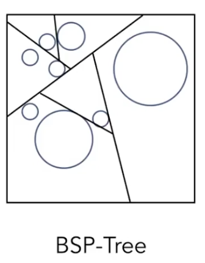

# Ray Tracing

## Ray Tracing Whitted-Style Ray Tracing

光栅化对于全局效果比较难以表现，比如软阴影，Glossy Reflection，Indirect illumination

对于具体如何计算，参考《Ray Trace in one week》和《The next Week》这两本书的内容

光线与三角形求交就是光线与那个三角形平面求交，然后考虑这个点是否在三角形内

## 包围盒，空间划分的方法

### Oct-Tree

随着维度n的上升，树的叉也会变多，为2^n 个叉

### KD-Tree

相比较Oct-Tree，它的划分不会随着维度的增大而增大

每次都只沿着一个轴砍开，而不像Oct-Tree对每个轴都分割一刀，这样得到的结果将空间分割成为二叉树的形式
切割的过程是交替的，也就是对于整个空间，如果先进行水平划分，下一步就是对划分出来的两个水平空间都进行竖直的划分…这样保证整体上满足均匀的划分方式

中间节点的存储的信息：

+ 沿着轴进行分割：x-, y-, z-轴
+ 沿着位置进行分割：
+ 子节点指针：指向子节点
+ 在中间节点，不会存储任何object（即所有object都只存储在叶节点上）

叶节点中存储的信息：

+ list of object

但是最近10年间逐渐弃用了KD-Tree，因为它不好写整个代码，而且**对于三角形与AABB有交点这个问题也是非常难以表述**的（会有很多Corner Case，比如，一个AABB盒在一个三角形内部，就会出现三角形3个点都不在AABB中，但是实际上是相交的情况）
而且也会出现一个物体与多个AABB有交集的问题，**在几个叶子节点上都要存储同一个物体的问题**：

上图的圆，跨越3个AABB，这3个AABB叶节点都要存储一个这个物体，表述不是那么直观与合理

### BSP-Tree

选择一个方向对节点进行分割，但是在维度较高时依然比较复杂，不好计算

## Object Partition & Bounding Volume Hierarchy（BVH）

将物体分成2堆，然后分别求他们的包围盒

特点：一个物体就只能出现在一个叶子节点里面

但是BVH没有很好地划分开空间，包围盒可能相交；而且到底什么划分方法更有效，是有一定讲究的，所以直到现在对于BVH的研究还是非常多的

### 建立BVH的整体思路：

+ 找到包围盒
+ 递归地区分割物体集变成2个子集
+ 重新计算包围盒的子集
+ 直到合适的时候停止
+ 将每个物体存在每个叶节点上

### 核心问题：怎么分割出子节点？

方法1：总是沿着最长的一个轴进行分割 
方法2：沿着中间的那个object进行分割

划分到某个节点中只有几个物体时结束划分（比如只有5个时terminate）

## 对比BVH与KD-Tree两种划分思想：

+ 空间划分法（如KD-Tree）

1、划分出来的空间与空间之间不会产生交集 
2、一个物体会存在在多个划分区域中

+ 物体划分法（如BVH）

1、将物体的集合划分成为disjoint subsets（即物体不会同时出现在两个划分区域中） 
2、包围盒之间对于空间上存在很多重叠的部分

更多的情况下现在选择的是BVH的划分方式