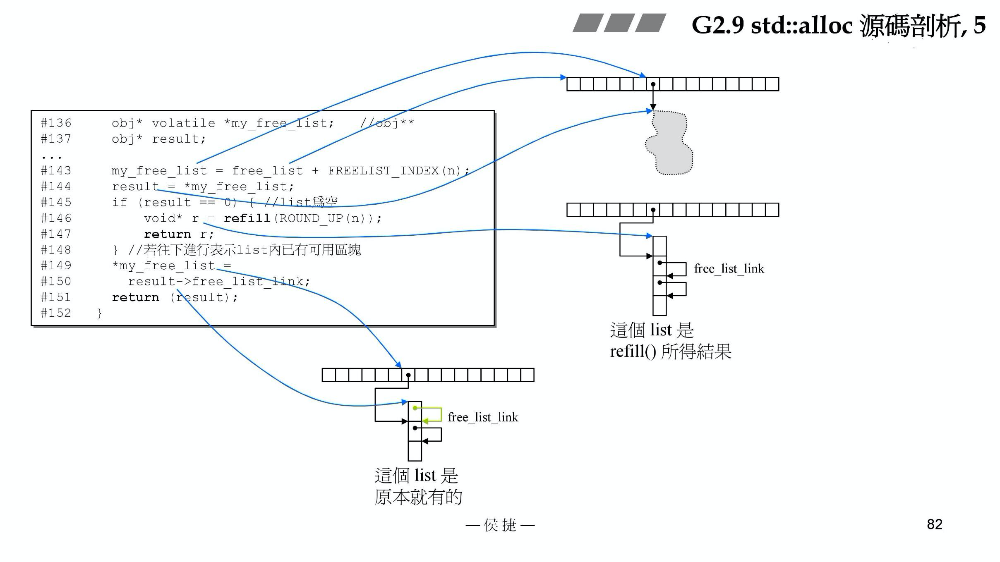
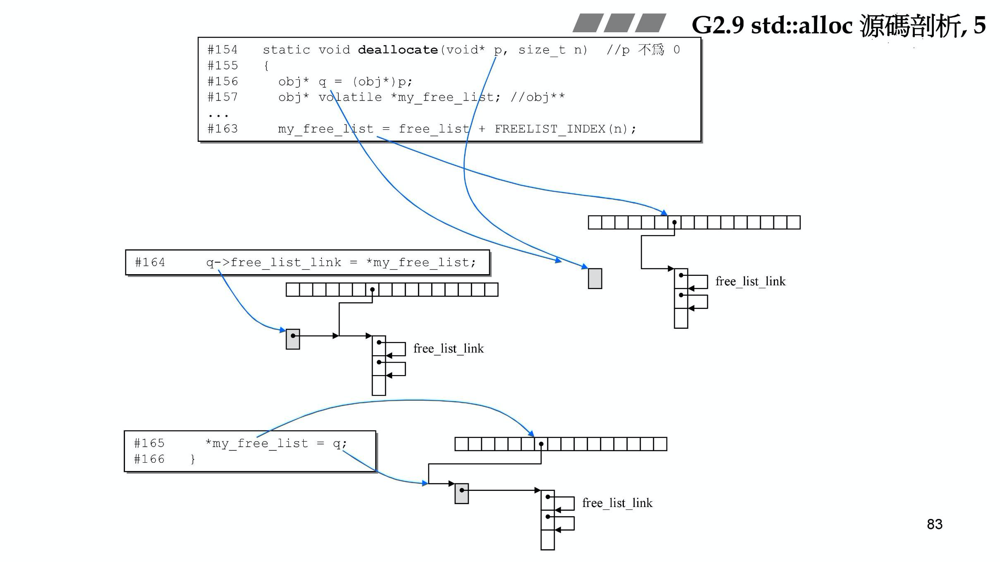
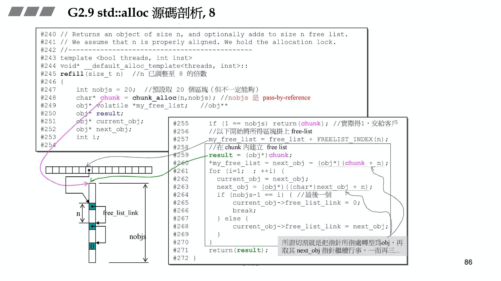
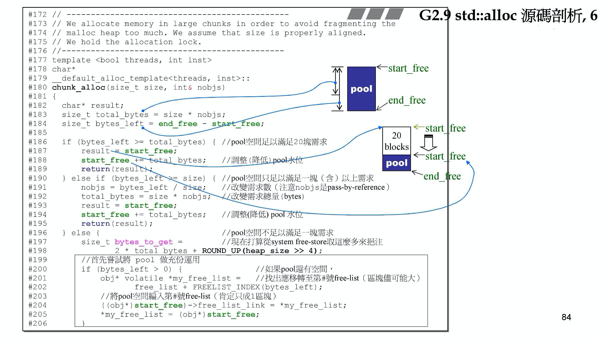
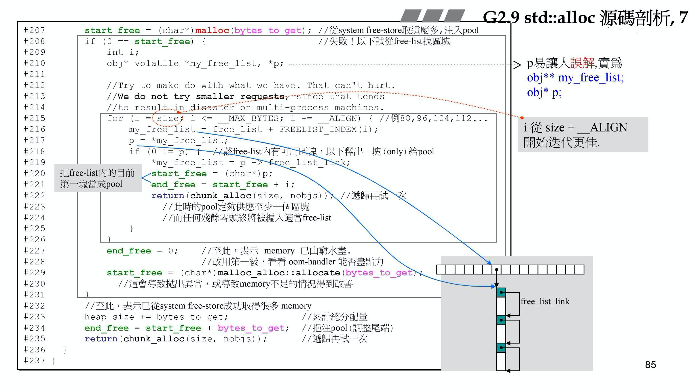
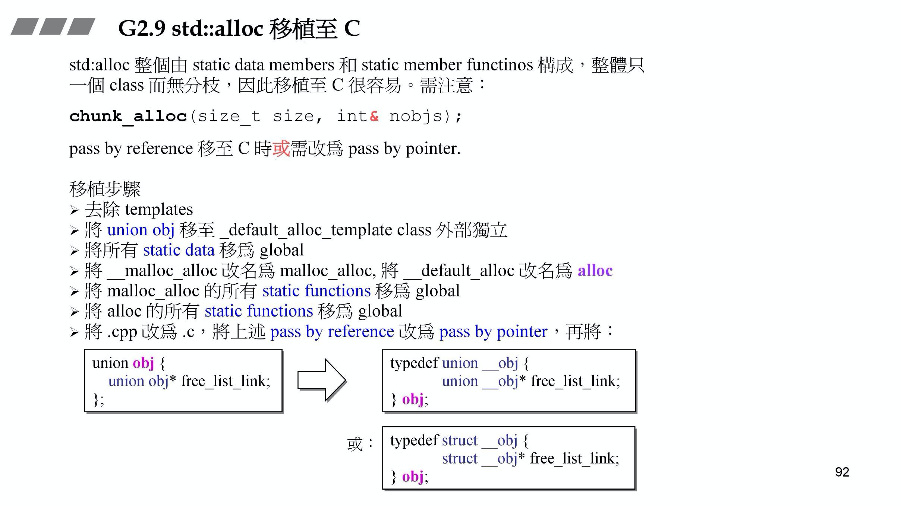

# std::allocator 与 pool_allocator

主要在工业界中面对的是海量的小区块问题，而且很多小区块的大小是完全相同或者在海量中只有不多的几种类型大小，首先我们要记住：**分配器的客户是容器，而不是程序员，如果直接去用分配器，因为没有了Cookies，你就需要自己记住你申请了多少，释放时才能让分配器归还到合适的链表中去**

我们开始从llvm源码来看看标准分配器是怎么做的

```cpp
//llvm/libcxx/include/memory  line-1830 缩减版
template <class _Tp>
class _LIBCPP_TEMPLATE_VIS allocator
{
public:
    typedef size_t            size_type;
    typedef ptrdiff_t         difference_type;
    typedef _Tp*              pointer;
    typedef const _Tp*        const_pointer;
    typedef _Tp&              reference;
    typedef const _Tp&        const_reference;
    typedef _Tp               value_type;

    _LIBCPP_NODISCARD_AFTER_CXX17 _LIBCPP_INLINE_VISIBILITY
    pointer allocate(size_type __n, allocator<void>::const_pointer = 0)
        {
        if (__n > max_size())
            __throw_length_error("allocator<T>::allocate(size_t n)"
                                 " 'n' exceeds maximum supported size");
        return static_cast<pointer>(_VSTD::__libcpp_allocate(__n * sizeof(_Tp), _LIBCPP_ALIGNOF(_Tp)));
        }
    _LIBCPP_INLINE_VISIBILITY void deallocate(pointer __p, size_type __n) _NOEXCEPT
        {_VSTD::__libcpp_deallocate((void*)__p, __n * sizeof(_Tp), _LIBCPP_ALIGNOF(_Tp));}
};

//其中__libcpp_allocate的代码 llvm/libcxx/include/new line-237
inline _LIBCPP_INLINE_VISIBILITY void *__libcpp_allocate(size_t __size, size_t __align) {
#ifndef _LIBCPP_HAS_NO_ALIGNED_ALLOCATION
  if (__is_overaligned_for_new(__align)) {
    const align_val_t __align_val = static_cast<align_val_t>(__align);
# ifdef _LIBCPP_HAS_NO_BUILTIN_OVERLOADED_OPERATOR_NEW_DELETE
    return ::operator new(__size, __align_val);
# else
    return __builtin_operator_new(__size, __align_val);
# endif
  }

//其中__libcpp_deallocate的代码到最后为以下部分（去掉一些检查分支） llvm/libcxx/include/new line-321
  template <class _A1>
  static inline void __do_call(void *__ptr, _A1 __a1) {
#if defined(_LIBCPP_HAS_NO_BUILTIN_OPERATOR_NEW_DELETE) || \
    defined(_LIBCPP_HAS_NO_BUILTIN_OVERLOADED_OPERATOR_NEW_DELETE)
    return ::operator delete(__ptr, __a1);
#else
    return __builtin_operator_delete(__ptr, __a1);
#endif
  }
```

可以看到这里的调用都是简单地`::operator new`与`::operator delete`而已，那么并不能节省cookies，虽然这样也是符合STL标准的，但是这在面对类型不多但是同一对象很多的数据情况下，在内存消耗上有着一定的缺陷

所以这里参考《STL源码剖析》中使用的是SGI版本的STL中的`std::alloc`或者现在GNU的`ext/pool_allocator.h`进行改进

由之前内容可知，`new`和`delete`都是实际上由2段操作构成：

+ 配置内存（`alloc::allocate()`）
+ 用构造函数对得到的内存进行构造（或者说要一个`placement new`）（`::construct()`）

同理`delete`也就是

+ 将对象进行析构（`::destroy()`）
+ 释放内存（`alloc::deallocate()`）

以上括号中的就是STL的接口，配置器定义在`<memory>`中，[源码](https://github.com/gcc-mirror/gcc/blob/master/libstdc%2B%2B-v3/include/std/memory)。看其中的line 64~66，

```cpp
#include <bits/allocator.h>

//定义了全局的函数construct()和destroy()，来负责对象的构造与析构
#include <bits/stl_construct.h>

//定义了一些全局函数来fill或copy大块的内存区域
//包括uninitialized_copy、uninitialized_fill与uninitialized_fill_n
#include <bits/stl_uninitialized.h>
```

全文也将详细分析与讨论这几个文件及其相关实现文件中代码

## 构造与析构（`construct`与`destory`）

`stl_construct.h`中最差的情况是调用`construct`，最好的情况是使用`memmove()`直接进行内存数据的移动

```cpp
//gcc/libstdc++-v3/include/bits/stl_construct.h
#include <new>

//line 101 Construct
  /**
   * Constructs an object in existing memory by invoking an allocated
   * object's constructor with an initializer.
   */
#if __cplusplus >= 201103L
  template<typename _Tp, typename... _Args>
    constexpr _Tp*
    _Construct(_Tp* __p, _Args&&... __args)
    {
#if __cplusplus > 201703L
      return std::construct_at(__p, std::forward<_Args>(__args)...);
#else
      return ::new(static_cast<void*>(__p)) _Tp(std::forward<_Args>(__args)...);//placement new在__p所给的内存上调用Tp::Tp(Args...)
#endif
    }
#else
  template<typename _T1, typename _T2>
    inline _T1*
    _Construct(_T1* __p, const _T2& __value)
    {
      // _GLIBCXX_RESOLVE_LIB_DEFECTS
      // 402. wrong new expression in [some_]allocator::construct
      return ::new(static_cast<void*>(__p)) _T1(__value);//在STL源码剖析这本书中是这样的基础版本，placement new；调用T1::T1(value)
    }
#endif

//line 139
//Destory第一版本，接受一个指针进行析构
  /**
   * Destroy the object pointed to by a pointer type.
   */
  template<typename _Tp>
    _GLIBCXX14_CONSTEXPR inline void
    _Destroy(_Tp* __pointer)
    {
#if __cplusplus > 201703L
      std::destroy_at(__pointer);
#else
      __pointer->~_Tp();//调用dtor ~Tp()
#endif
    }

//line 175
//destory第二版本。目的是设法找出元素的类型，进而利用__type_traits<>来使用最合适的措施处理
      /**
   * Destroy a range of objects.  If the value_type of the object has
   * a trivial destructor, the compiler should optimize all of this
   * away, otherwise the objects' destructors must be invoked.
   */
  template<typename _ForwardIterator>
    _GLIBCXX20_CONSTEXPR inline void
    _Destroy(_ForwardIterator __first, _ForwardIterator __last)
    {
      typedef typename iterator_traits<_ForwardIterator>::value_type
                       _Value_type;
#if __cplusplus >= 201103L
      // A deleted destructor is trivial, this ensures we reject such types:
      static_assert(is_destructible<_Value_type>::value, 
            "value type is destructible");
#endif
#if __cplusplus > 201703L && defined __cpp_lib_is_constant_evaluated
      if (std::is_constant_evaluated())
        return _Destroy_aux<false>::__destroy(__first, __last);
#endif
      std::_Destroy_aux<__has_trivial_destructor(_Value_type)>::__destroy(__first, __last);
    }
```

对于上面的`std::_Destroy_aux<__has_trivial_destructor(_Value_type)>::__destroy(__first, __last);`会有两种情况，即`true`和`false`，首先我们要知道什么是`trivial destructor`（析构函数是“无关痛痒”，没有什么用处的，比如`char*`，`wchar_t*`这种内置类型等），这样一次次的调用没有什么用处的析构函数如果整个循环很大，会对效率产生巨大的影响

```cpp
//line 150
//如果发现元素的value_type有non-trivial destructor，就依次对每个上面的元素进行析构
      template<bool>
    struct _Destroy_aux
    {
      template<typename _ForwardIterator>
        static _GLIBCXX20_CONSTEXPR void
        __destroy(_ForwardIterator __first, _ForwardIterator __last)
        {
        for (; __first != __last; ++__first)
            std::_Destroy(std::__addressof(*__first));
        }
    };
//如果发现元素的value_type有trivial destructor，就不操作
  template<>
    struct _Destroy_aux<true>
    {
      template<typename _ForwardIterator>
        static void
        __destroy(_ForwardIterator, _ForwardIterator) { }
    };
```

<hr>

## 空间的配置与释放（`alloc`）

考虑到小型区块引发的内存碎片问题，SGI设计双层级配置器，第一级别直接使用`malloc`和`free`。当配置区块超过128字节时，视为足够大，调用第一级分配器；当小于等于128字节时，算作小内存，调用第二级分配器；最外层用一个符合STL规格的接口进行封装

### 第一级分配器

在这里，`allocate()`直接调用`malloc()`，`deallocate()`直接调用`free()`

模拟C++中`::operator new`的做法，当内存不足时，调用`set_new_handler()`期待进行处理，如果无法进行，就干脆地抛出`bad_alloc`的异常或者强行终止程序

现在已经抛弃了这样模拟的设计，而是直接使用C++全局分配的给出的了`new_handler`来处理，以下是现在的源码：

```cpp
//gcc/libstdc++-v3/include/ext/pool_allocator.h line 212
//对其中缩进进行了一定整理
template<typename _Tp>
_Tp *__pool_alloc<_Tp>::allocate(size_type __n, const void *)
{
    pointer __ret = 0;
    if (__builtin_expect(__n != 0, true))
    {
        if (__n > this->max_size())//max_size() = size_t(-1) / sizeof(_Tp)
            std::__throw_bad_alloc();

        const size_t __bytes = __n * sizeof(_Tp);

#if __cpp_aligned_new
        if (alignof(_Tp) > __STDCPP_DEFAULT_NEW_ALIGNMENT__)
        {
            std::align_val_t __al = std::align_val_t(alignof(_Tp));
            return static_cast<_Tp *>(::operator new(__bytes, __al));
        }
#endif

        // If there is a race through here, assume answer from getenv
        // will resolve in same direction.  Inspired by techniques
        // to efficiently support threading found in basic_string.h.
        if (_S_force_new == 0)
        {
            if (std::getenv("GLIBCXX_FORCE_NEW"))
                __atomic_add_dispatch(&_S_force_new, 1);
            else
                __atomic_add_dispatch(&_S_force_new, -1);
        }

        //如果大小大于128bytes，就调用普通的::operator new（底层为malloc）
        if (__bytes > size_t(_S_max_bytes) || _S_force_new > 0)
            __ret = static_cast<_Tp *>(::operator new(__bytes));
        else//第二级分配器（下文会单独讨论）
        {
            _Obj *volatile *__free_list = _M_get_free_list(__bytes);

            __scoped_lock sentry(_M_get_mutex());
            _Obj *__restrict__ __result = *__free_list;
            if (__builtin_expect(__result == 0, 0))
                __ret = static_cast<_Tp *>(_M_refill(_M_round_up(__bytes)));
            else
            {
                *__free_list = __result->_M_free_list_link;
                __ret = reinterpret_cast<_Tp *>(__result);
            }
            if (__ret == 0)
                std::__throw_bad_alloc();
        }
    }
    return __ret;
}

template<typename _Tp>
void __pool_alloc<_Tp>::deallocate(pointer __p, size_type __n)
{
    if (__builtin_expect(__n != 0 && __p != 0, true))
    {
#if __cpp_aligned_new
        if (alignof(_Tp) > __STDCPP_DEFAULT_NEW_ALIGNMENT__)
        {
            ::operator delete(__p, std::align_val_t(alignof(_Tp)));
            return;
        }
#endif
        const size_t __bytes = __n * sizeof(_Tp);
        //第一级分配器
        if (__bytes > static_cast<size_t>(_S_max_bytes) || _S_force_new > 0)
            ::operator delete(__p);
        else//第二级分配器
        {
            _Obj *volatile *__free_list = _M_get_free_list(__bytes);
            _Obj *__q = reinterpret_cast<_Obj *>(__p);

            __scoped_lock sentry(_M_get_mutex());
            __q->_M_free_list_link = *__free_list;
            *__free_list = __q;
        }
    }
}
```

### 第二级分配器

由于区块越小，使用malloc得到的内存中，cookie所占用的比例越大，这也就意味着巨大的额外开销

维护16个自由链表，来控制对于16种小型区块的次配置能力（按8字节为一组，128 = 8 * 16），内存池由`malloc`申请得到。这其中的链表就使用之前文章中介绍的`union`的方式来一块内存两用（这种思路在强类型语言中是不行的）

```cpp
//gcc/libstdc++-v3/include/ext/pool_allocator.h line 78
//gcc/libstdc++-v3/src/c++98/pool_allocator.cc line 48
//部分内容从cc实现文件转移到了一起便于分析

class __pool_alloc_base
{
protected:

  enum { _S_align = 8 };
  enum { _S_max_bytes = 128 };
  enum { _S_free_list_size = (size_t)_S_max_bytes / (size_t)_S_align };
  
  union _Obj
  {
union _Obj* _M_free_list_link;
char        _M_client_data[1];    // The client sees this.
  };
  
  static _Obj* volatile         _S_free_list[_S_free_list_size];

  //关于内存池的一些指示
  // Chunk allocation state.
  static char*                  _S_start_free;//指向pool的头
  static char*                  _S_end_free;//指向pool的尾
  static size_t                 _S_heap_size;//分配累计量
  
  //Round up，作用是上调到8的倍数
  size_t
  _M_round_up(size_t __bytes)
  { return ((__bytes + (size_t)_S_align - 1) & ~((size_t)_S_align - 1)); }
  
  //根据区块的大小，决定使用第n号free-list，n从0开始计数
  _GLIBCXX_CONST _Obj* volatile*
  _M_get_free_list(size_t __bytes) throw ()
  {
    size_t __i = ((__bytes + (size_t)_S_align - 1) / (size_t)_S_align - 1);
    return _S_free_list + __i;
  }

  __mutex&
  _M_get_mutex() throw ();

  // Returns an object of size __n, and optionally adds to size __n
  // free list.
  void*
  _M_refill(size_t __n);//充值
  
  // Allocates a chunk for nobjs of size size.  nobjs may be reduced
  // if it is inconvenient to allocate the requested number.
  char*
  _M_allocate_chunk(size_t __n, int& __nobjs);//申请一大块内存
};
```

这里与《STL源码剖析》中不同的是，这部分的allocate在派生类中根据申请的空间来选择走向，而不再是基类的实现，源码见上面第一部分中，下面是这部分专门摘出来精简过后进行讨论：

```cpp
//gcc/libstdc++-v3/include/ext/pool_allocator.h line 245
else//第二级分配器 allocate部分，去掉多线程相关代码
{
    _Obj *volatile *__free_list = _M_get_free_list(__bytes);//根据要申请的空间大小找出指向那个空间分配节点下的头指针位置的指针（pointer to pointer）

    _Obj *__restrict__ __result = *__free_list;//判断这个链表是不是空链表
    if (__builtin_expect(__result == 0, 0))//list为空
        __ret = static_cast<_Tp *>(_M_refill(_M_round_up(__bytes)));//使用refill函数进行充值，每个单元要Round_up到8的边界
    else//如果有可用区块
    {
        *__free_list = __result->_M_free_list_link;
        __ret = reinterpret_cast<_Tp *>(__result);
    }
    if (__ret == 0)
        std::__throw_bad_alloc();
}
```

图例：



<hr>

注意，回收部分是没有`free`的，也就是说，链表一旦膨胀，即使释放了，整个分配器的体积也不会减少，而是一直占有着这些资源（但是在多任务上这种行为不太好）：

```cpp
//gcc/libstdc++-v3/include/ext/pool_allocator.h line 281
else//第二级分配器 deallocate部分，去掉多线程相关代码
{
    _Obj *volatile *__free_list = _M_get_free_list(__bytes);//找到要回收的节点的邻接链表头
    _Obj *__q = reinterpret_cast<_Obj *>(__p);//修改为可串联的块，后续进行串联

    __q->_M_free_list_link = *__free_list;
    *__free_list = __q;
}
```



<hr>

在`allocate`函数中，可以看到`_M_refill`函数，这个函数调用情况是当发现那个本应该提供服务的链表是空的时候进行调用，整体上的动作即为充值，而里面拿到一大块内存的操作，交给其中的`_M_allocate_chunk`来做

```cpp
//gcc/libstdc++-v3/src/c++98/pool_allocator.cc line 129

// Returns an object of size __n, and optionally adds to "size
// __n"'s free list.  We assume that __n is properly aligned.  We
// hold the allocation lock.
void*
__pool_alloc_base::_M_refill(size_t __n)
{
    int __nobjs = 20;//默认一次最多为其分配20块相同大小的内存
    char* __chunk = _M_allocate_chunk(__n, __nobjs);//这里__nobjs是pass-by-reference，会保存到底给了多少块
    _Obj* volatile* __free_list;
    _Obj* __result;
    _Obj* __current_obj;
    _Obj* __next_obj;

    if (__nobjs == 1)//如果能够从内存池分配给这个区块的个数就只有1个，就直接给出
        return __chunk;

    //以下部分开始将从内存池得到的数个区块挂到链表上
    __free_list = _M_get_free_list(__n);

    // Build free list in chunk.
    __result = (_Obj*)(void*)__chunk;
    *__free_list = __next_obj = (_Obj*)(void*)(__chunk + __n);
    for (int __i = 1; ; __i++)
    {
        __current_obj = __next_obj;
        __next_obj = (_Obj*)(void*)((char*)__next_obj + __n);//通过字节来计算出下个链表节点的位置
        if (__nobjs - 1 == __i)//最后一个
        {
            __current_obj->_M_free_list_link = 0;
            break;
        }
        else
            __current_obj->_M_free_list_link = __next_obj;
    }
    return __result;
}
```



<hr>

`_M_allocate_chunk`这个函数就是如何从内存池中挖出一块内存分配出去，和如何在自己不够的时候向OS`malloc`到一块新的内存，同时将原来还剩余的作为碎片挂载到分配器链表中的东西，这些也是最为复杂的部分。

核心思想：最多分配出20个块，最少分配出一个块，要是一个块也给不出来

```cpp
//gcc/libstdc++-v3/src/c++98/pool_allocator.cc line 59

// Allocate memory in large chunks in order to avoid fragmenting the
// heap too much.  Assume that __n is properly aligned.  We hold the
// allocation lock.
char*
__pool_alloc_base::_M_allocate_chunk(size_t __n, int& __nobjs)//__nobjs是引用
{
    char* __result;
    size_t __total_bytes = __n * __nobjs;
    size_t __bytes_left = _S_end_free - _S_start_free;//pool的大小(尾-头)

    //如果pool剩余空间足够分配20个块，就直接分配出去
    if (__bytes_left >= __total_bytes)
    {
        __result = _S_start_free;
        _S_start_free += __total_bytes;
        return __result ;
    }
    else if (__bytes_left >= __n)//能不能至少满足一个块的需求，满足就尽量给出能给的最多的块
    {
        __nobjs = (int)(__bytes_left / __n);
        __total_bytes = __n * __nobjs;
        __result = _S_start_free;
        _S_start_free += __total_bytes;
        return __result;
    }
    else//连一个都给不出，发生碎片 / 或者碎片大小为0，无碎片
    {
        //先处理内存碎片，将碎片挂载到对应碎片大小的节点上去
        // Try to make use of the left-over piece.
        if (__bytes_left > 0)
        {
            _Obj* volatile* __free_list = _M_get_free_list(__bytes_left);
            ((_Obj*)(void*)_S_start_free)->_M_free_list_link = *__free_list;
            *__free_list = (_Obj*)(void*)_S_start_free;
        }

        //向OS申请一块新的内存的大小（跟要的块的大小和整个分配器已有大小都有关）
        size_t __bytes_to_get = (2 * __total_bytes
                                 + _M_round_up(_S_heap_size >> 4));
        __try
        {
            _S_start_free = static_cast<char*>(::operator new(__bytes_to_get));
        }
        __catch(const std::bad_alloc&)
        {
            //一旦失败，就从这个节点的后面一个大 8 bytes的节点地方尝试去拿一个进行补充
            // Try to make do with what we have.  That can't hurt.  We
            // do not try smaller requests, since that tends to result
            // in disaster on multi-process machines.
            size_t __i = __n;
            for (; __i <= (size_t) _S_max_bytes; __i += (size_t) _S_align)
            {
                _Obj* volatile* __free_list = _M_get_free_list(__i);
                _Obj* __p = *__free_list;
                if (__p != 0)
                {
                    *__free_list = __p->_M_free_list_link;
                    _S_start_free = (char*)__p;
                    _S_end_free = _S_start_free + __i;
                    return _M_allocate_chunk(__n, __nobjs);
                    // Any leftover piece will eventually make it to the
                    // right free list.
                }
            }
            // What we have wasn't enough.  Rethrow.
            _S_start_free = _S_end_free = 0;   // We have no chunk.
            __throw_exception_again;
        }
        //累计总的分配量，然后把新得到的内存注入pool，递归回去检查一下是不是满足了要求
        _S_heap_size += __bytes_to_get;
        _S_end_free = _S_start_free + __bytes_to_get;
        return _M_allocate_chunk(__n, __nobjs);
    }
}
```






<hr>

注意，以上讨论都是从heap得到的内存，而不是从stack来的，需要进行区分，比如：

```cpp
list<Foo> c;
c.push_back(Foo(1));
```

`Foo(1)`是从stack中得到的，本身不带有cookie。而`push_back`操作是把这块的东西copy进`list`容器中，这时候才调用了我们上述所讲的`alloc`取得内存

```cpp
Foo *p = new Foo(2);
c.push_back(*p);
```

这个`Foo(2)`则是从heap中得到的，本身相对于上面从stack得到的`Foo(1)`来说携带着cookie，`push_back`一样向分配器申请内存，copy进入`list`，但是容器中现在却是不带着cookie的（在`Foo(1)`时已经分配好了）

<hr>

## 比较`std::allocator`标准库

整个`ext/pool_allocator`可以在面对单个容器大小较小（如小于128 bytes），但是用量非常庞大情况下比`std::allocator`有着更好的优势，比如：

```cpp
for(int i = 0; i < 1000000; i++)
  list.push_back(i);
```

如果使用普通的分配器，就是每次需要简单地在`list`中`new`出空间，然后复制进去，调用了1000000次，而使用这样的`pool_allocator`就能够将这样的调用减少到122次，因为每一次申请内存都要包含一个`cookie`，假设大小为8 bytes，这样可以节约非常大的一笔内存开销

但是这个的劣势是没有对于申请来之后内存的释放，而是一直性的占有，这样如果调用到达一次峰值之后，内存占有始终会保持峰值，对OS下运行的其他程序可能存在影响

<hr>

## 移植

因为整个操作都是静态成员函数，所以我们可以在需要的时候将其移植到C语言平台上去：



<hr>

## 内存基本处理工具（`uninitialized_copy`、`uninitialized_fill`与`uninitialized_fill_n`）

STL定义了5个全局函数用于未初始化的空间上，这样的功能对实现很有帮助，除了在本文最上面所论述的`construct`和`destory`外，还有另外三个函数

+ `uninitialized_copy`：使用拷贝构造函数，对于未初始化的内存区域上复制构造[first,last)的元素
+ `uninitialized_fill`：使用拷贝构造函数，对于未初始化的内存区域上构造元素`__x`的复制，并将其填充满迭代器[first, last)空间
+ `uninitialized_fill_n`：在上面的基础上限定复制的个数，而不再限定last

### `uninitialized_copy`

```cpp
//gcc/libstdc++-v3/include/bits/stl_uninitialized.h line 79 代码格式有整理

template<bool _TrivialValueTypes>
struct __uninitialized_copy
{
    template<typename _InputIterator, typename _ForwardIterator>
    static _ForwardIterator
    __uninit_copy(_InputIterator __first, _InputIterator __last,
                  _ForwardIterator __result)
    {
        _ForwardIterator __cur = __result;
        __try
        {
            for (; __first != __last; ++__first, (void)++__cur)//核心，对于当前的内存写入输入对象[first, last)范围内的每一个对象的复制
                std::_Construct(std::__addressof(*__cur), *__first);
            return __cur;
        }
        __catch(...)//保证原子性，"commit or rollback"
        {
            std::_Destroy(__result, __cur);
            __throw_exception_again;
        }
    }
};

//POD的特化，往往是系统内置类型
template<>
struct __uninitialized_copy<true>
{
    template<typename _InputIterator, typename _ForwardIterator>
    static _ForwardIterator
    __uninit_copy(_InputIterator __first, _InputIterator __last,
                  _ForwardIterator __result)
    { return std::copy(__first, __last, __result); }
};

/// @endcond

/**
 *  @brief Copies the range [first,last) into result.
 *  @param  __first  An input iterator.
 *  @param  __last   An input iterator.
 *  @param  __result An output iterator.
 *  @return   __result + (__first - __last)
 *
 *  Like copy(), but does not require an initialized output range.
*/
template<typename _InputIterator, typename _ForwardIterator>
inline _ForwardIterator
uninitialized_copy(_InputIterator __first, _InputIterator __last,
                   _ForwardIterator __result)
{
    typedef typename iterator_traits<_InputIterator>::value_type
            _ValueType1;
    typedef typename iterator_traits<_ForwardIterator>::value_type
            _ValueType2;
#if __cplusplus < 201103L
    const bool __assignable = true;
#else
    // Trivial types can have deleted copy constructor, but the std::copy
    // optimization that uses memmove would happily "copy" them anyway.
    static_assert(is_constructible<_ValueType2, decltype(*__first)>::value,
                  "result type must be constructible from value type of input range");

    typedef typename iterator_traits<_InputIterator>::reference _RefType1;
    typedef typename iterator_traits<_ForwardIterator>::reference _RefType2;
    // Trivial types can have deleted assignment, so using std::copy
    // would be ill-formed. Require assignability before using std::copy:
    const bool __assignable = is_assignable<_RefType2, _RefType1>::value;
#endif

    return std::__uninitialized_copy<__is_trivial(_ValueType1)
                                     && __is_trivial(_ValueType2)
                                     && __assignable>::
    __uninit_copy(__first, __last, __result);
}
```

### `uninitialized_fill`

```cpp
template<bool _TrivialValueType>
struct __uninitialized_fill
{
    template<typename _ForwardIterator, typename _Tp>
    static void
    __uninit_fill(_ForwardIterator __first, _ForwardIterator __last,
                  const _Tp& __x)
    {
        _ForwardIterator __cur = __first;
        __try
        {
            for (; __cur != __last; ++__cur)//就是完全复制__x多份去填充未初始化的内存
                std::_Construct(std::__addressof(*__cur), __x);
        }
        __catch(...)//与上面类似，也是要保持操作原子性
        {
            std::_Destroy(__first, __cur);
            __throw_exception_again;
        }
    }
};

//POD的特化，往往是系统内置类型
template<>
struct __uninitialized_fill<true>
{
    template<typename _ForwardIterator, typename _Tp>
    static void
    __uninit_fill(_ForwardIterator __first, _ForwardIterator __last,
                  const _Tp& __x)
    { std::fill(__first, __last, __x); }
};

/// @endcond

/**
 *  @brief Copies the value x into the range [first,last).
 *  @param  __first  An input iterator.
 *  @param  __last   An input iterator.
 *  @param  __x      The source value.
 *  @return   Nothing.
 *
 *  Like fill(), but does not require an initialized output range.
*/
template<typename _ForwardIterator, typename _Tp>
inline void
uninitialized_fill(_ForwardIterator __first, _ForwardIterator __last,
                   const _Tp& __x)
{
    typedef typename iterator_traits<_ForwardIterator>::value_type
            _ValueType;
#if __cplusplus < 201103L
    const bool __assignable = true;
#else
    // Trivial types can have deleted copy constructor, but the std::fill
    // optimization that uses memmove would happily "copy" them anyway.
    static_assert(is_constructible<_ValueType, const _Tp&>::value,
                  "result type must be constructible from input type");

    // Trivial types can have deleted assignment, so using std::fill
    // would be ill-formed. Require assignability before using std::fill:
    const bool __assignable = is_copy_assignable<_ValueType>::value;
#endif

    std::__uninitialized_fill<__is_trivial(_ValueType) && __assignable>::
    __uninit_fill(__first, __last, __x);
}
```

### `uninitialized_fill_n`

```cpp
template<bool _TrivialValueType>
struct __uninitialized_fill_n
{
    template<typename _ForwardIterator, typename _Size, typename _Tp>
    static _ForwardIterator
    __uninit_fill_n(_ForwardIterator __first, _Size __n,
                    const _Tp& __x)
    {
        _ForwardIterator __cur = __first;
        __try
        {
            for (; __n > 0; --__n, (void) ++__cur)//填充n个，与上面不同的，上面是全填充
                std::_Construct(std::__addressof(*__cur), __x);
            return __cur;
        }
        __catch(...)//依旧保持原子性
        {
            std::_Destroy(__first, __cur);
            __throw_exception_again;
        }
    }
};

//POD的特化，往往是系统内置类型
template<>
struct __uninitialized_fill_n<true>
{
    template<typename _ForwardIterator, typename _Size, typename _Tp>
    static _ForwardIterator
    __uninit_fill_n(_ForwardIterator __first, _Size __n,
                    const _Tp& __x)
    { return std::fill_n(__first, __n, __x); }
};

/// @endcond

// _GLIBCXX_RESOLVE_LIB_DEFECTS
// DR 1339. uninitialized_fill_n should return the end of its range
/**
 *  @brief Copies the value x into the range [first,first+n).
 *  @param  __first  An input iterator.
 *  @param  __n      The number of copies to make.
 *  @param  __x      The source value.
 *  @return   Nothing.
 *
 *  Like fill_n(), but does not require an initialized output range.
*/
template<typename _ForwardIterator, typename _Size, typename _Tp>
inline _ForwardIterator
uninitialized_fill_n(_ForwardIterator __first, _Size __n, const _Tp& __x)
{
    typedef typename iterator_traits<_ForwardIterator>::value_type
            _ValueType;
#if __cplusplus < 201103L
    const bool __assignable = true;
#else
    // Trivial types can have deleted copy constructor, but the std::fill
    // optimization that uses memmove would happily "copy" them anyway.
    static_assert(is_constructible<_ValueType, const _Tp&>::value,
                  "result type must be constructible from input type");

    // Trivial types can have deleted assignment, so using std::fill
    // would be ill-formed. Require assignability before using std::fill:
    const bool __assignable = is_copy_assignable<_ValueType>::value;
#endif
    return __uninitialized_fill_n<__is_trivial(_ValueType) && __assignable>::
    __uninit_fill_n(__first, __n, __x);
}
```

注意以上三个的代码，共通点：

+ 第一步都是先对输入的类型进行萃取操作，得到其`value_type`，一旦类型是`__is_trivial(_ValueType) && __assignable`，也就是说这个类型一旦是**POD(Plain Old Data)**，即也就是拥有trivial ctor/dtor/copy/assigmnet等函数，就可以直接填写初值的方式进行特化加速，不再需要调用`std::_Construct`进行构造
+ 三个操作都是原子化的，一旦出错，全部销毁
