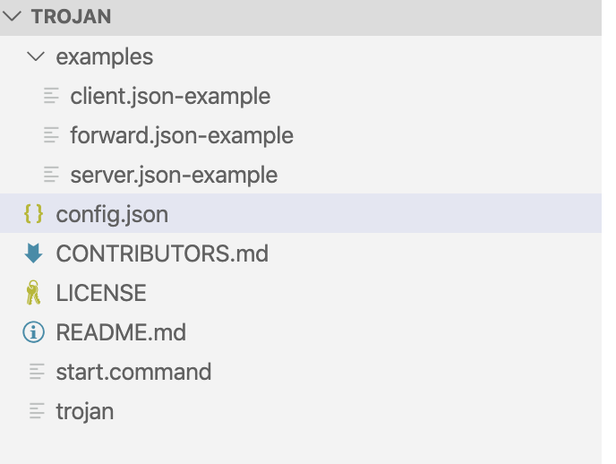
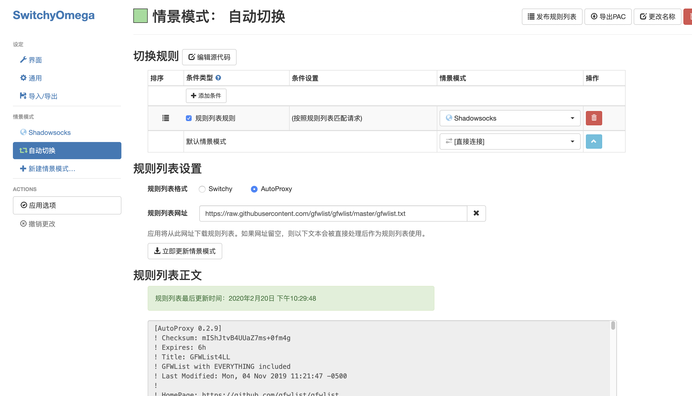
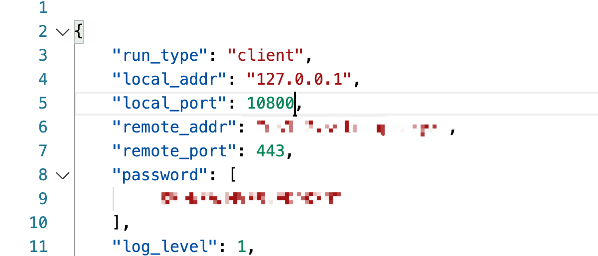
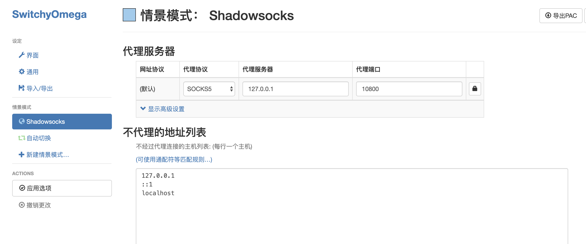
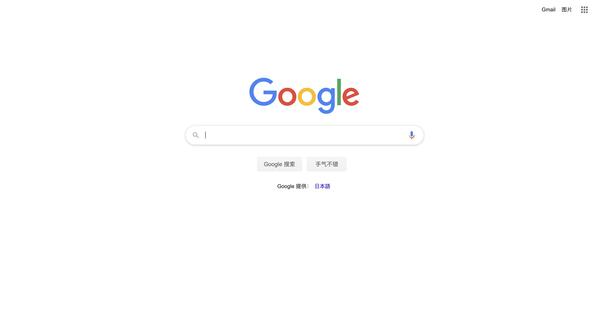

因为中国大陆特殊的条件，自2019年起越来越多的ss服务被gfw检测，阻断。我购买的服务商也从原来提供ss转向提供trojan协议的服务（ss也有，但是基本上都是超时，有个锤子用，笑
trojan的服务器端的配置，我没有配（没有信用卡，不然就去买Google Cloud了，而且我购买的服务商已经帮我配好了并且提供的各种必要的数据
服务器端的配置建议参考YouTube的以下内容进行：

[Trojan搭建！8K秒开！2020年最流行的翻墙方式！Windows/MacOS Trojan客户端使用教程，Trojan配置！谷歌云搭建Trojan，哪些节点支持奈飞播放？Trojan谷歌云表现？](https://www.youtube.com/watch?v=ozY_5J23okY)

接下来就是我们主要关注的客户端的配置，客户端主要分为win和mac两种：
+ win：因为我手中暂时没有，略。但是网上文章较多，还是比较方便的。
+ mac：从Github中进行下载，[https://github.com/trojan-gfw/trojan/releases](https://github.com/trojan-gfw/trojan/releases)，选择mac包，下载下来东西如下：

暂时trojan没有全局的策略，所以我只是设置了chrome下的配置：需要先从google商店中下载 Proxy SwitchyOmega （好像出现了先有鸡还是先有蛋的问题，随便找个vpn试用一下，然后去google商店下下来吧~

然后删掉原来的规则，编写以下规则并进行应用，即gfwlist中的，走trojan协议，除此之外的，走默认的方式（不翻墙），似乎我们还可以引用whitelist方式，这个我记得github中也有，可以确认一下

实际上trojan和ss一样通过一个端口而已，我认为全局也是很容易的，明天试试看
对于config.json，我们需要进行如下修改：

Remote_addr和password填写vps提供商给你的（或者购买后自己搭建出来的）

Local_port：默认为1080，但是我以防万一设置了10800，避免端口号冲突等问题的发生，注意，这里的设置改变也需要在上面的switchyomega中进行相应的修改

最后，启动trojan中的start.command，打开Chrome，google.com-OK!

TODO List:
1、研究一下如何进行trojan全局化
2、修改Chrome插件中配置，更新一下gfwlist