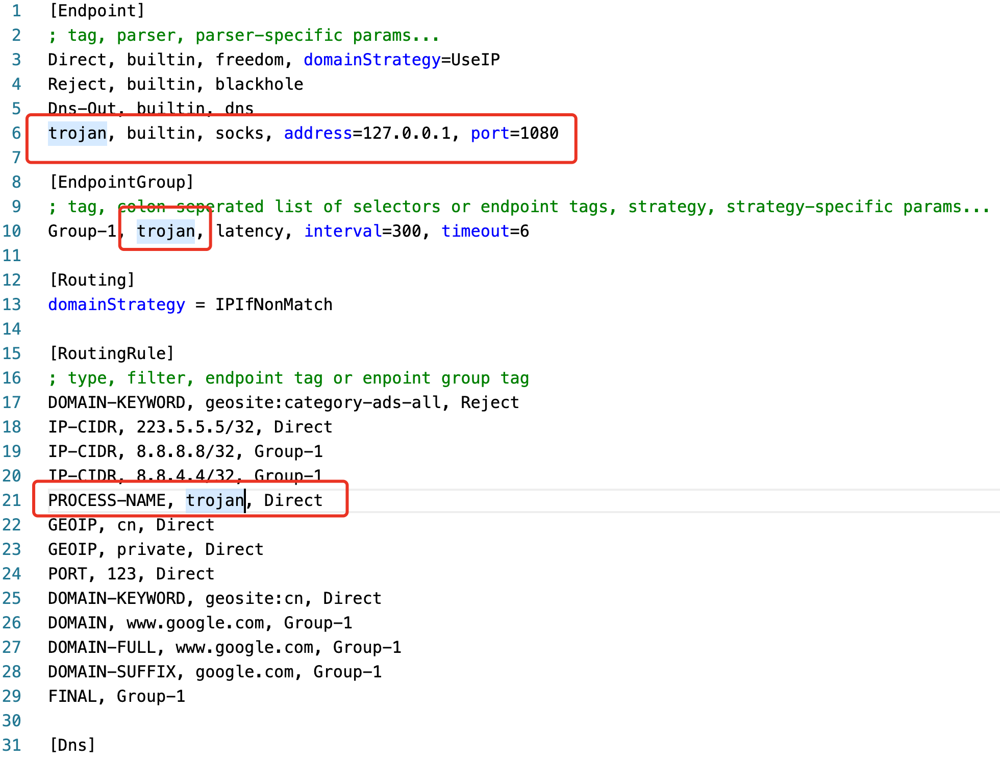
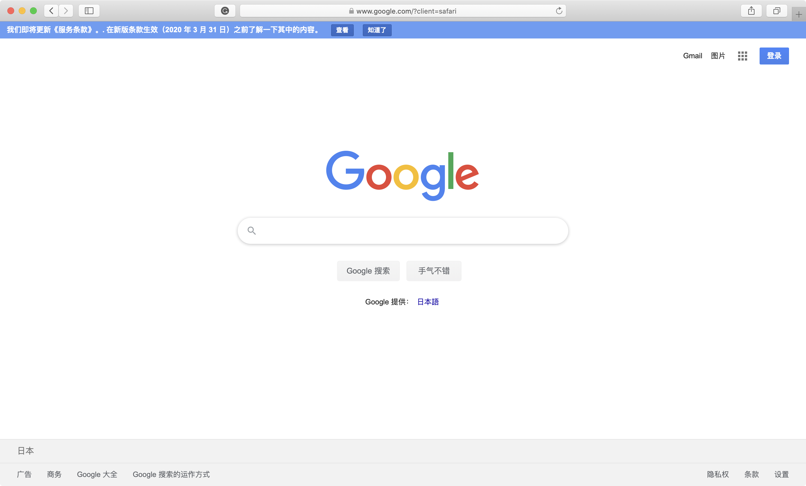

同样的，本文将基于Mac系统
经过测试，现在来说，使用mellow程序进行全局化是比较合适与方便的
mellow下载地址为：[https://github.com/mellow-io/mellow](https://github.com/mellow-io/mellow)
前一篇文章设定的port是10800，但是这里如果port设定太高似乎有问题（不知道为啥之前的10800端口一直起不来），重新改成1080的端口，设置修改如下

我们动用的是socks代理，所以这里的sock要改成我们的地址与端口，具体内容参考YouTube：

[翻墙 | trojan分流和客户端使用](https://www.youtube.com/watch?v=Gkxvh6uVWU4)

然后使用Safari进行一下测试吧~

注意，使用chrome的话可以把之前设置的Proxy SwitchyOmega插件里面的自动转换改成系统代理（也就是这个插件不再起作用，全部走mellow的配置）