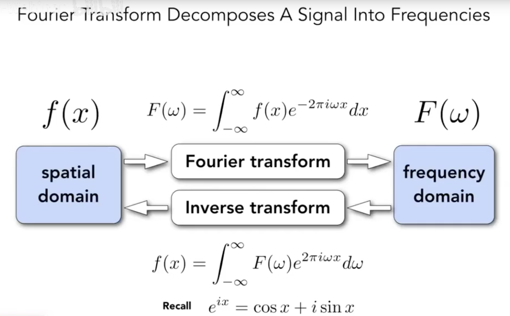
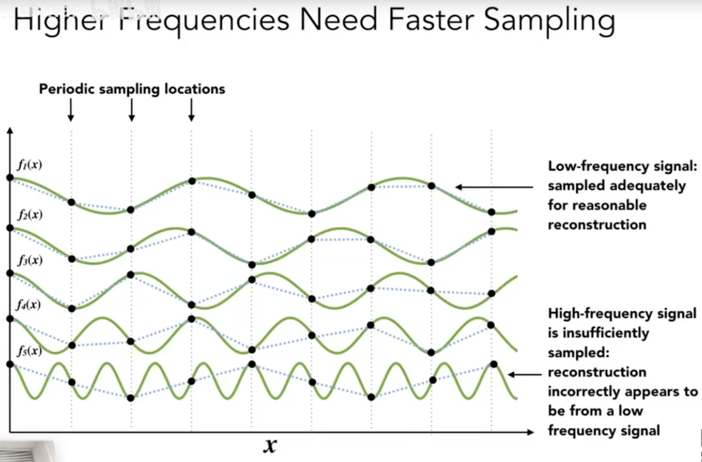
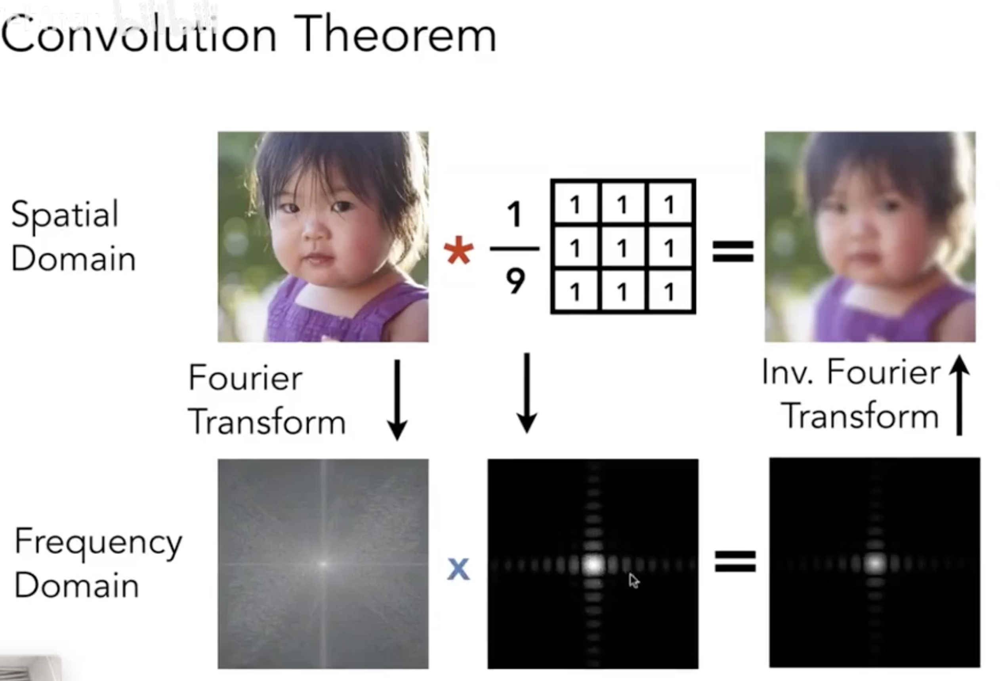
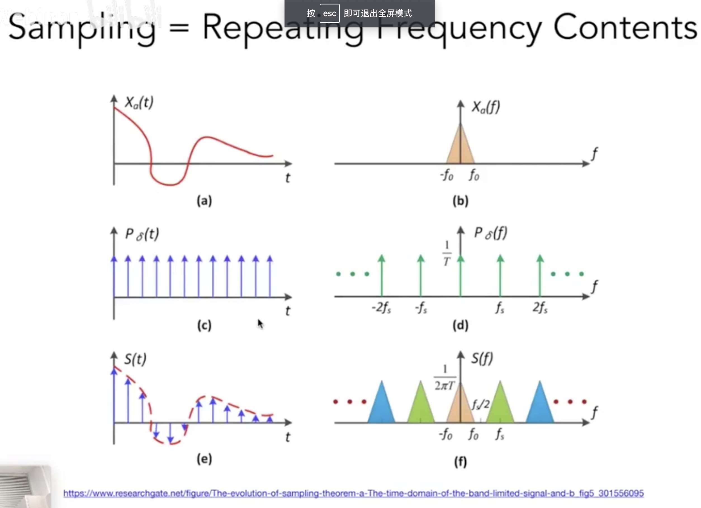
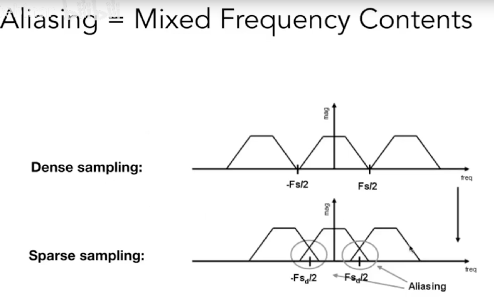
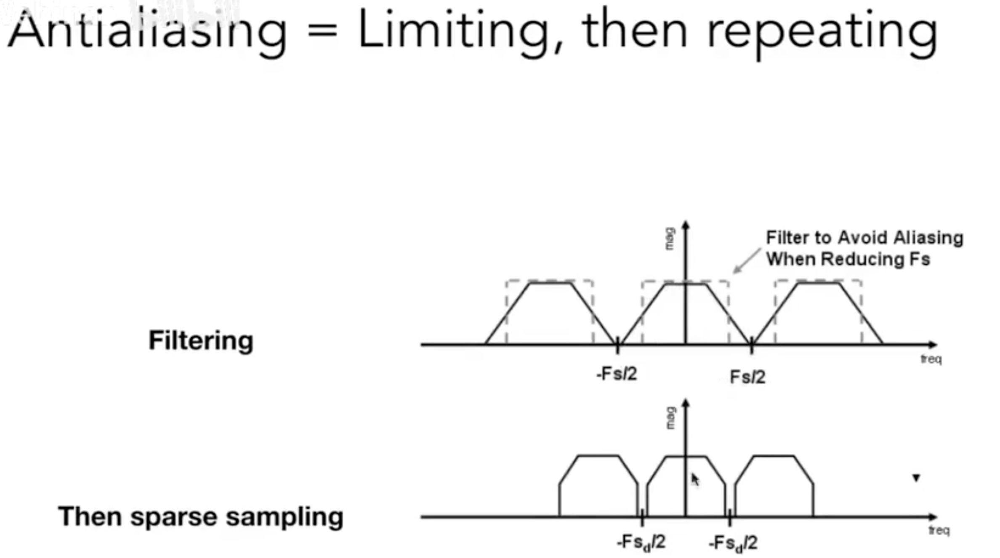
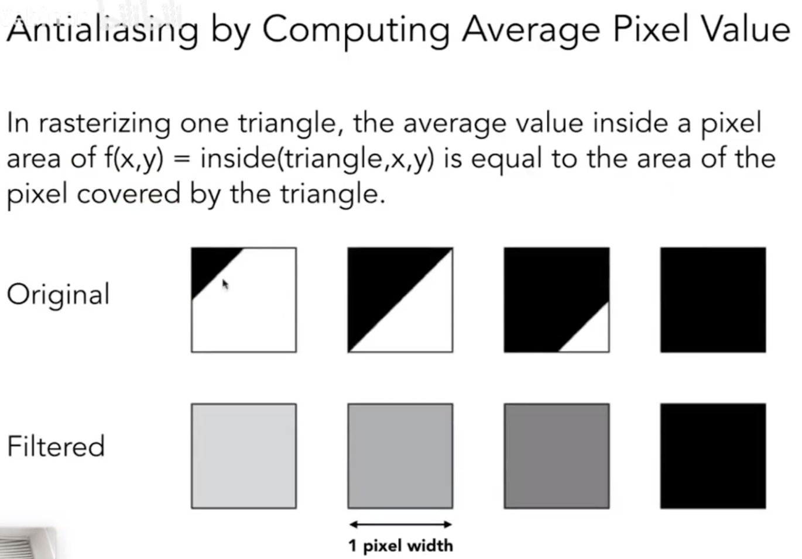
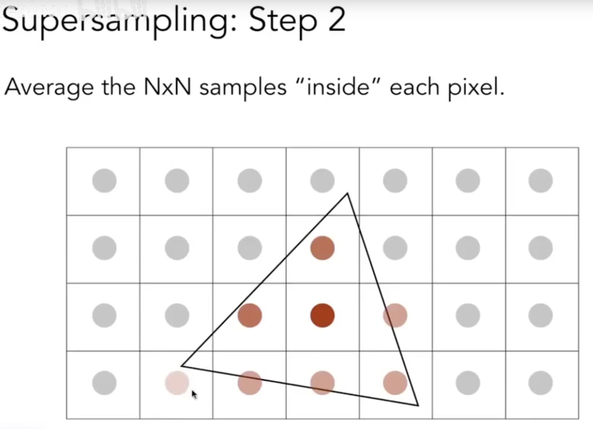
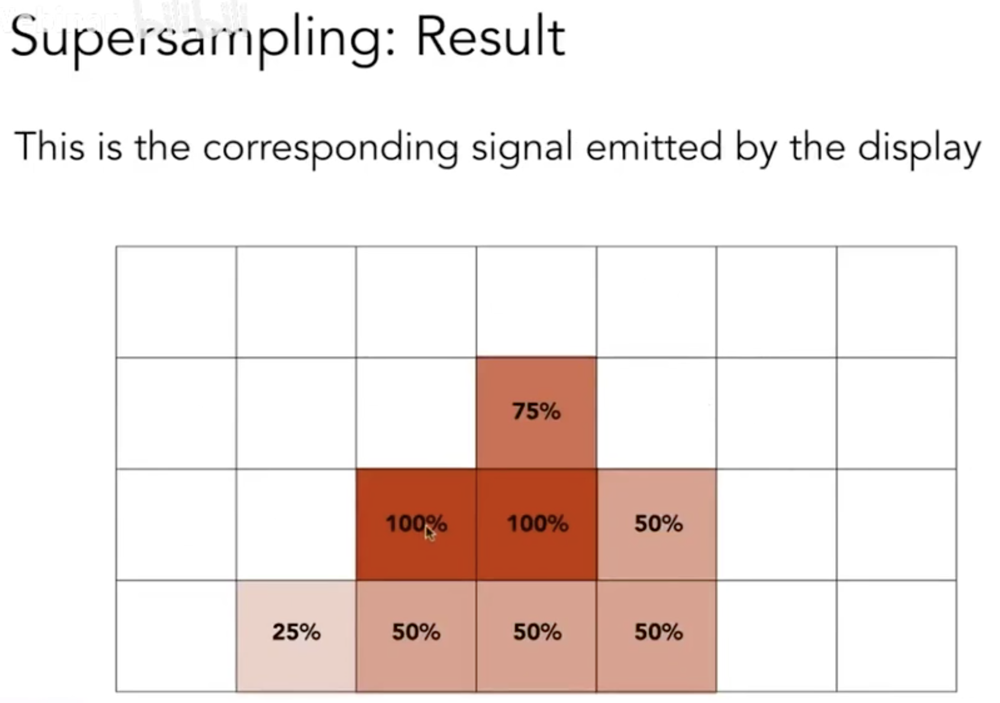

最前面感谢Lingqi Yan老师的[视频](https://www.bilibili.com/video/av90798049?p=6)，本文根据Yan的视频进行总结，如有错误，是因为笔者水平所限，理解不当，还望见谅

走样从本质上来说是：采样速度跟不上信号的速度

最Trivial的方法：用三角形进行采样，拿着像素的中心点进行判定，会造成采样问题（锯齿）

- Pre-Filter：在采样之前先进行一次模糊，再用原来的对像素中心点进行采样，这时候采到什么颜色就是什么颜色，就能很好地解决锯齿问题

这个操作用《信号与系统》的语言描述即为：对于信号在采样之前进行一次滤波。

- Q：要是先采样后滤波是否能达到类似效果？
- A：不行！（这种操作学名：Blurred Aliasing）
- Q：Why？

### 前置知识

#### 傅里叶级数

对于任意周期函数，都可以写成正弦/余弦函数的组合+常数项

#### 傅里叶变换与逆傅里叶变换

#### 采样频率高低与真实情况之间的关系

只有更高的采样频率才能够近似正确描述出原来的频率，如果用相同的采样频率，对于本身频率高的情况，会产生描述错误（比较下图的第一个和最后一个，完全最后一个的拟合与真实相比完全是错误的）

#### 有关图像中高低频信息的含义

- 高频信息：图像中的轮廓边界（因为颜色等信号在轮廓边界会发生剧烈变化）
- 低频信息：图像中的形状内部

#### 卷积定理

两信号在时域的卷积积分对应于在频域中该两信号的傅立叶变换的乘积

## 如何应用上述知识来对图像进行处理？

由卷积定理可知，对于图像来说，使用卷积核的方法就能够使得图像发生变化：

### 采样在信号中的含义

- 原始的信号函数(a)×冲激函数(c) = 采样的结果(e)；
- 原始函数的频域(b) * 傅里叶变换后的冲激函数(d) = 新的频域（f） 其实这个卷积有点像对于频谱按照一定频率复制粘贴了很多份
- (f)也是(e)进行傅里叶变换后的结果

<b>所以采样就是：重复一个原始信号的频谱！</b>

### 为什么会走样？

因为采样率不足的情况下会导致频谱出现间隔变小，非常密集的情况；由此发生混合交叉，这时就发生了走样

### 如何克服走样的情况？
- 增加采样率（钞能力，比如再买一块分辨率更好的显示器etc.）
- 先做模糊，后做采样（原理：模糊就是低通滤波，删掉高频信息）

也就是对频谱进行裁剪，删掉两端的高频，保留中间的低频，自然在采样率低的情况下避免了频谱的重叠

### 有了以上知识，如何去模糊一个三角形？

- A：用一个一定大小的低通滤波器进行卷积（去掉高频信号）

用一个像素作为一个box filter，先进行卷积操作，然后对于求完平均值的像素进行采样（在这里：convolving = filtering = averaging）

这里也就是根据覆盖的不同，产生不同的颜色混合，完成整个的反走样

## 图形学上的反走样技术背后的原理

### MSAA：

将一个像素划分成好多小的像素，判断小的点是不是在三角形内，然后将这些小像素进行平均，得到一个像素的值

注意：

- Q：我们近似的是什么？
- A：是模糊的整个过程。然后得到每个像素的覆盖率，然后求出平均，得到一个结果

到此为止，第一部分的模糊操作已经完成

第二步：采样，因为一个像素就已经变成一个颜色，所以只要在像素中间采样即可

也就是说，<b>MSAA解决的是对于信号的模糊操作！而不是提升分辨率直接解决的采样问题！</b>

但是天下没有免费的午餐！我们牺牲了什么？
- 增加了计算量

那我们怎么削减一点计算量呢？（工业界做法）
- 可以使用更加优势的图案来分割像素得到子像素，而不一定是均匀分摊一个像素
- 一个像素的子像素的结果可能会被邻近像素的子像素复用
- ...

### 另外的拓展：FXAA(Fast Approximate AA)，TAA(Temporal AA)

- FXAA：利用图像的后处理，先得到有锯齿的图，然后进行后处理去去除之（找到边界，然后把有锯齿的进行替换，而且操作非常快）
- TAA：找到上一帧的信息进行比对复用，上一帧感知得到的值在本帧中还会发挥作用（将MSAA得到的信息分布在时间轴上，而且没有引入任何额外的操作）

## 一个相近的概念：Super resolution / Super sampling

将一张小图像拉大会产生大量的锯齿，如何在拉大的情况下不产生锯齿（如从512×512 -\> 1024 ×1024）也就是需要解决样本不足的问题

现在主流是使用DLSS（Deep Learning Super Sampling）技术对缺失的信息进行猜测还原