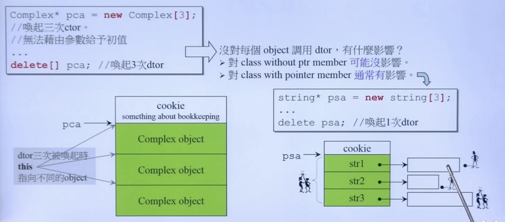

容器(containers) 通过分配器(allocator)来分配内存(memory)

### 四种alloc primitive比较：

|分配|释放|类属|可重载性|
|:-:|:-:|:-:|:-:|
|`malloc`|`free()`|C 函数|不可  |
|`new`|`delete`|C++ 表达式|不可|
|`::operator new()`|`::operator delete()`|C++ 函数|可|
|`allocator<T>::allocate()`|`allocator<T>::deallocate()`|C++ 标准库|可自由设计用以搭配需要的容器 |

```cpp
//1	
void* p1 = malloc(512);
free(p1);

//2
complex<int>* p2 = new complex<int>;
delete p2;

//3，内部操作调用即为1
void *p3 = ::operator new(512);
::operator delete(p3);
```

对于C++来说，同样使用标准库的`allocators`，但是接口上具有区别

```cpp
#ifdef _MSC_VER_WORKAROUND_GUARD
	int *p4 = std::allocator<int>().allocate(3, (int *) 0);//第二个参数其实是没有用的（也是默认设定为0），且调用函数为non-static
	std::allocator<int>().deallocate(p4, 3);
#endif
#ifdef __BORLANDC___WORKAROUND_GUARD
	//同上，只是在这个环境下，不再必定需要第二参数
	int* p4 = std::allocator<int>().allocate(5);
	std::allocator<int>().deallocate(p4, 5);
#endif
#ifdef __GNUC__
	//调用函数为static，且请求出来的是字节（很早之前的了，已经不见了）
	void* p4 = alloc::allocate(512);
	alloc::deallocate(p4, 512);
#endif
```

更新后的GNUC的代码：

```cpp
#ifdef __GNUC__
	void *p4 = std::allocator<int>().allocate(7);
	std::allocator<int>().deallocate((int *) p4, 7);

	void *p5 = __gnu_cxx::__pool_alloc<int>().allocate(9);
	__gnu_cxx::__pool_alloc<int>().deallocate((int *) p5, 9);
#endif
```

### 理解`new`，`::operator new()`，`malloc`等之间的区别

本身的一行代码：

```cpp
Complex *pc = new Complex(1, 2);
```

编译器很可能翻译成为：

```cpp
Complex *pc;
try {
	void *mem = operator new(sizeof(Complex));
	pc = static_cast<Complex*>(mem);
	pc->Complex::Complex(1, 2);//这种构造函数的调用是只有编译器才能够进行的
	//想要直接操作，可以运用placement new（以后再讨论）:
	// new(p)Complex(1, 2);
}
catch (std::bad_alloc){

}
```

而上面的`operator new`底层就是`malloc`

```cpp
//llvm/libcxx/src/new.cpp
void *
operator new(std::size_t size) _THROW_BAD_ALLOC
{
    if (size == 0)
        size = 1;
    void* p;
    while ((p = ::malloc(size)) == 0)//如果成功就会不等于0，从而跳出来
    {
        // If malloc fails and there is a new_handler,
        // call it to try free up memory.
        std::new_handler nh = std::get_new_handler();
        if (nh)//new_handler函数就是我们自己写的，这里应该会进行内存释放来支持后续对于new的成功调用
            nh();
        else
#ifndef _LIBCPP_NO_EXCEPTIONS
            throw std::bad_alloc();
#else
            break;
#endif
    }
    return p;
}
```

### 相对应的`delete`与`free`的关系：

```cpp
Complex *pc = new Complex(1, 2);
...
delete pc;
```

编译器可能翻译成为：

```cpp
pc->~Complex();//先进行析构，这个操作程序员是可以直接调用的，而不一定必须借用编译器
operator delete(pc);//然后释放内存
```

源码上`operator delete`到底在干啥？

```cpp
//llvm/libcxx/src/new.cpp
void
operator delete(void* ptr) _NOEXCEPT
{
    ::free(ptr);
}
```

### `array new`，`array delete`在干啥？

```cpp
Complex* pca = new Complex[3];
//调用3次构造函数
//无法给予参数初始值
...
delete[] pca;//调用3次析构函数
```

首先，这个一定需要注意：对于`new[]`一定要配对`delete[]`，否则**容易**造成**内存泄漏**！
- 编译器怎么知道需要执行`delete`多少次呢？——在`malloc`的时候，会在头前面给出一个cookie，包含块的各种信息，`free`依靠这些信息进行析构（所有的平台都有这样的设计）
- 为什么说是`容易`，而不是`一定`呢？——对于class without ptr member可能会没有影响（因为之前的cookie存在，free知道回收的大小），对于class with ptr member通常会有影响！比如

```cpp
string* psa = new string[3];
...
delete psa;
```

因为每个`string`需要另外再分配一段内存存储，而cookie不知道这个分配需要的具体的长度，所以cookie无法判定由于`string`长度带来的次生的整个申请空间的大小，所以会在这里发生内存泄漏（也就是原来的3个指针地址空间被回收了，而指针指向的空间就1个被回收，2个泄漏了）



